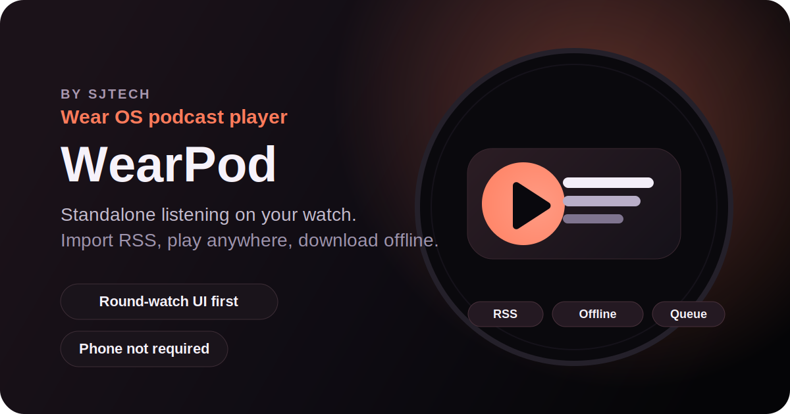
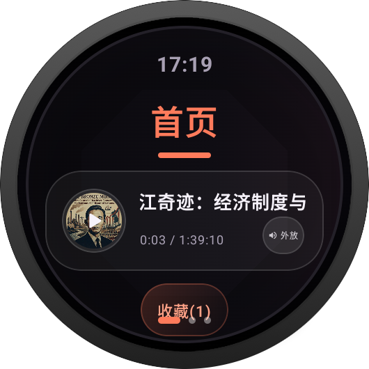
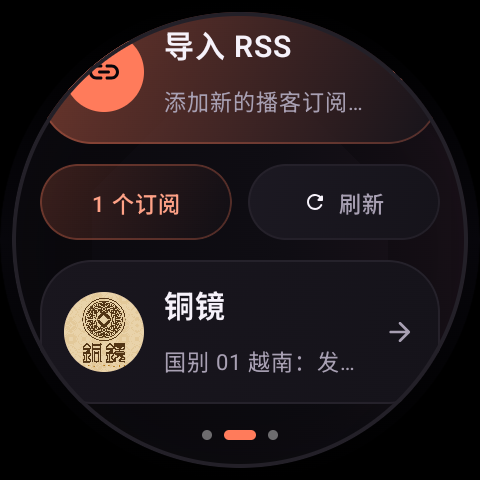
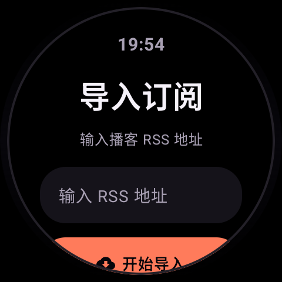
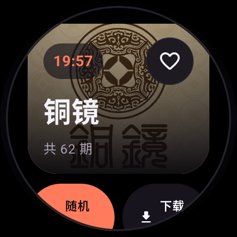
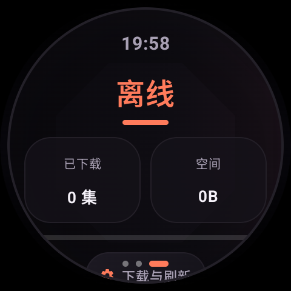
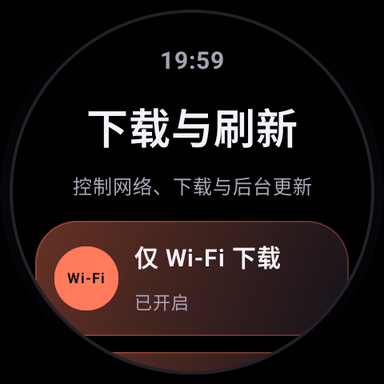

# WearPod

[](https://github.com/Chenfyuan/wearpod/releases)
[](https://github.com/Chenfyuan/wearpod/actions/workflows/android.yml)
[](./LICENSE)

[English README](./README.md)

> 一个由 SJTech 打造的独立 Wear OS 手表播客播放器。
>
> 扫码导入 RSS、离线收听、尽量不依赖手机。



WearPod 是 SJTech 打造的、面向圆形手表优先设计的独立 Wear OS 播客应用原型。

它不依赖手机 companion app。当前版本的目标很明确：用户可以优先通过“手表出二维码、手机扫码导入”的方式导入播客，也可以保留手表上手动输入 RSS 的兜底路径，然后在小屏设备上完成浏览、播放和离线收听。

## 预览



| 订阅 | 导入订阅 | 播客详情 |
| --- | --- | --- |
|  |  |  |

| 播放器 | 离线 | 下载与刷新设置 |
| --- | --- | --- |
|  |  |  |

## 当前已支持的能力

- 直接在手表上导入公开播客 RSS
- 通过二维码发起手机辅助导入，支持手机上输入 RSS 或上传 OPML
- 通过二维码发起手机辅助导出，在手机上下载 OPML 备份
- 不依赖手机管理订阅
- 收藏播客，并在首页展示收藏内容
- 浏览节目列表，并支持 `全部`、`未播`、`已下载` 三种筛选
- 基于 `Media3` 进行在线播放
- 基于 `WorkManager` 下载离线节目
- 查看下载队列、下载失败项和已下载列表
- 配置下载行为：
  - 仅 Wi-Fi 下载
  - 自动下载最新 `0-3` 期
  - 后台自动下载
- 按 `6`、`12`、`24` 小时执行后台定时刷新
- 控制播放队列：
  - 上一集 / 下一集
  - 切换当前队列中的节目
  - 快退 / 快进
  - 切换播放倍速
  - 支持在播放器中调节媒体音量，并响应实体音量键
- 在播放器中使用睡眠定时：
  - `15 / 30 / 60` 分钟

## 产品范围

WearPod 的定位是 `watch-first` 播客客户端，而不是播客平台。

当前范围：

- 独立运行的 Wear OS 应用
- 基于公开 RSS 的播客订阅
- 手表端轻量播客库与播放体验
- 手机只参与低频导入，播放与管理仍以手表为主
- 手表端离线收听

当前版本明确不做：

- 手机同步
- 云端账号系统
- 播客发现与推荐后台
- 私有或付费订阅鉴权

## 页面结构

当前应用由 3 个顶层页面组成：

- `首页`：继续播放、收藏内容、快捷上下文
- `订阅`：导入和管理播客订阅
- `离线`：下载队列、失败列表、离线库、下载与刷新设置

二级页面包括：

- `导入订阅`
- `手机导入`
- `播客详情`
- `播放器`
- `下载与刷新设置`

## 技术栈

- Kotlin
- Jetpack Compose for Wear OS
- Media3
- WorkManager
- Coil 3
- 使用 Room 存储订阅、节目和收藏关系
- 使用 DataStore Preferences 存储播放记忆、下载设置和睡眠定时

## 环境要求

- 安装了 Wear OS 支持的 Android Studio
- JDK 17
- 可用的 Android SDK / build tools，满足：
  - `compileSdk = 36`
  - `minSdk = 30`
  - `targetSdk = 36`
- Wear OS 模拟器或真机

## 快速开始

### 1. 构建应用

如果当前网络环境下 Gradle wrapper 可以正常下载依赖：

```bash
./gradlew assembleDebug
./gradlew testDebugUnitTest
```

如果 wrapper 无法下载分发包，可以直接使用系统安装的 Gradle：

```bash
gradle assembleDebug --no-daemon
gradle testDebugUnitTest --no-daemon
```

### GitHub Actions release 构建

仓库已经包含一个 Android workflow，用来生成未签名的 release APK：

- 在 `push`、`pull_request`、`workflow_dispatch` 和 GitHub `release` 时运行
- 将 `app-release-unsigned.apk` 上传为 workflow artifact
- 在发布 GitHub Release 时，把同一个未签名 APK 挂到 release 页面

### 2. 安装到 Wear OS 模拟器或设备

```bash
adb devices
adb -s <device-id> install -r app/build/outputs/apk/debug/app-debug.apk
```

### 3. 启动应用

```bash
adb -s <device-id> shell am start -n com.sjtech.wearpod/.MainActivity
```

### 4. 本地启动手机导入 relay

二维码手机导入依赖仓库里的轻量 relay 服务，目录在 [`relay/`](/Users/linwj44/wearpod/relay)：

```bash
cd relay
npm install
npm start
```

默认本地调试配置：

- 手表访问 relay API：`http://10.0.2.2:8787`
- 手机二维码打开的网页：`http://localhost:8787`

如果要部署给真机使用，请把 app 和 relay 都指向同一个公网 HTTPS 地址：

```bash
./gradlew assembleDebug -PwearpodImportRelayApiBaseUrl=https://your-relay.example.com
PUBLIC_BASE_URL=https://your-relay.example.com npm start
```

### 5. 在服务器上重复部署 relay

仓库里已经带了一个可复用的 Docker 部署脚本：

```bash
bash scripts/deploy-relay.sh
```

如果你想固定部署某个提交，也可以直接传 Git ref 或 commit：

```bash
bash scripts/deploy-relay.sh 327d431d9a1469c588dbefd8ebae058c70e9884e
```

常用覆盖参数示例：

```bash
PUBLIC_BASE_URL=https://wearpod.linsblog.cn \
HOST_BIND=127.0.0.1 \
PORT=8787 \
bash scripts/deploy-relay.sh main
```

### 6. 准备正式签名

项目已经支持“本地配置正式签名，但密钥不进 git”的方式。

1. 先复制模板：

```bash
cp release-signing.properties.example release-signing.properties
```

2. 在 `release-signing.properties` 里填入你真实的 keystore 路径和密码。

3. 需要正式签名包时直接构建：

```bash
./gradlew assembleRelease
```

真实的 `release-signing.properties` 已经被 `.gitignore` 忽略。你也可以通过 Gradle 属性或环境变量传入同一组参数：

- `WEARPOD_RELEASE_STORE_FILE`
- `WEARPOD_RELEASE_STORE_PASSWORD`
- `WEARPOD_RELEASE_KEY_ALIAS`
- `WEARPOD_RELEASE_KEY_PASSWORD`

## 开发说明

### Debug 示例订阅源

在 `DEBUG` 构建中，如果应用当前还没有任何订阅，会自动导入一个示例 RSS：

- `https://feed.xyzfm.space/xpa79uvcn9lw`

它只用于加快模拟器体验，不是正式产品逻辑的一部分。

### 手机导入 relay

当前二维码导入会创建一个短时有效的导入会话，手机端可以提交：

- 一个 RSS 地址
- 一个 OPML 文件

真正的 feed 抓取和本地入库仍由手表完成。

### 持久化模型

当前版本使用分层持久化：

- `Room` 存储订阅、节目和收藏关系
- `DataStore Preferences` 存储播放记忆、下载设置和睡眠定时

如果用户从旧版本升级，WearPod 会在首次启动时自动把原来的 `wearpod_state.json` 迁移到这套新存储结构中。

### 后台任务

当前后台任务包括：

- `EpisodeDownloadWorker`：单集下载
- `SubscriptionRefreshWorker`：周期性订阅刷新

后台刷新只会在以下条件满足时运行：

- 设置中已开启后台定时刷新
- 当前至少存在一个订阅
- 设备有可用网络
- 当前不是低电量状态

## 项目结构

- `app/src/main/java/com/sjtech/wearpod/ui`
  - Compose 页面、交互逻辑、手表端 UI 组织
- `app/src/main/java/com/sjtech/wearpod/ui/components`
  - 可复用的手表 UI 组件
- `app/src/main/java/com/sjtech/wearpod/data`
  - 数据模型、仓储、存储、RSS 解析
- `app/src/main/java/com/sjtech/wearpod/playback`
  - `MediaSessionService` 与播放器控制层
- `app/src/main/java/com/sjtech/wearpod/download`
  - 离线下载调度与 Worker
- `app/src/main/java/com/sjtech/wearpod/sync`
  - 周期性订阅刷新调度与 Worker
- `docs/plans`
  - 设计说明和实现计划文档

## 当前限制

- 仅支持公开 RSS
- 暂不支持私有或付费订阅鉴权
- 二维码手机导入当前依赖单独运行的 relay 服务
- 不支持手表 / 手机 / Web 云端同步
- 当前已经迁移到 Room + DataStore，但除了旧 JSON 的首次导入之外，后续 schema migration 机制仍然比较基础
- 蓝牙与音频输出状态的提示体验仍然可以继续完善

## 本地验证

本地已使用以下命令验证：

```bash
gradle assembleDebug --no-daemon
gradle testDebugUnitTest --no-daemon
```

## 版本说明

- [v0.1.0](./docs/releases/v0.1.0.zh-CN.md)
- [GitHub 仓库文案](./docs/github-repo-copy.md)

## 开源协议

本项目使用 [MIT License](./LICENSE)。

## 后续路线

接下来最值得继续推进的方向：

1. OPML 导出
2. 私有 / 付费订阅支持
3. 搜索
4. 更明确的蓝牙与音频输出引导
5. 更稳健的数据持久化与恢复能力
